## Visual Architecture

The suite intentionally visualizes each failure mode as a
BUGGY -> symptom -> detection vs FIXED -> mitigation flow.

### Fault Mode Toggle

The `Toggle` mechanism controls which implementation is executed by the test suite.

The selected mode is provided through the `--fault-mode` CLI option and processed by the shared `pytest` configuration in `tests/conftest.py`. The configuration parametrizes the tests and injects the appropriate `Toggle` instance into tests that request the `toggle` fixture.

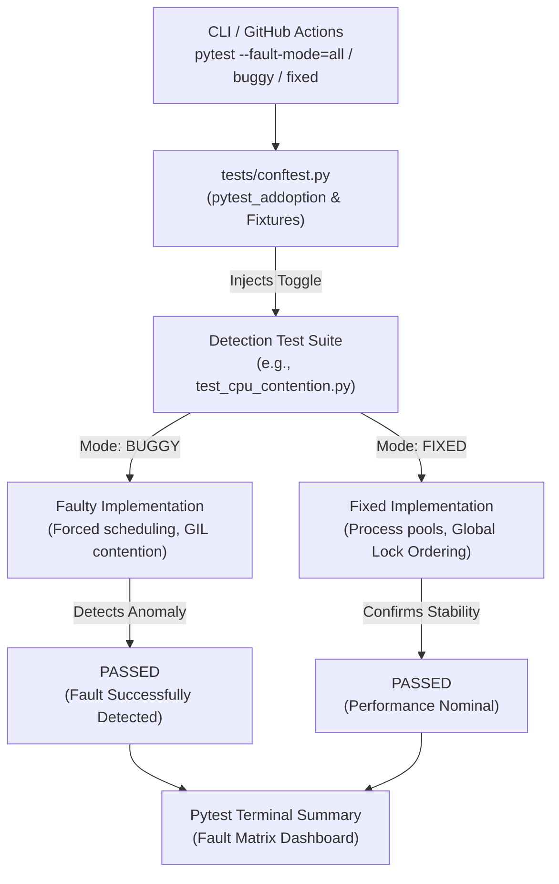

#### Execution modes

| Mode                 | Behaviour                                          |
| -------------------- | -------------------------------------------------- |
| `--fault-mode=fixed` | Runs only the correct implementations              |
| `--fault-mode=buggy` | Runs only the intentionally faulty implementations |
| `--fault-mode=all`   | Runs both implementations                          |

This keeps fault injection separate from the detection logic: the test itself verifies the expected behaviour, while `Toggle` determines which implementation is under test.

### Race Condition
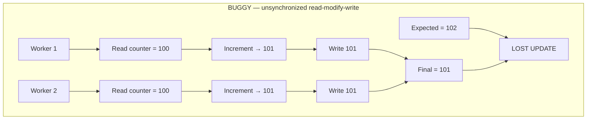

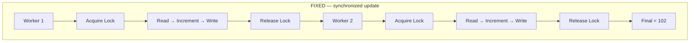

### Deadlock
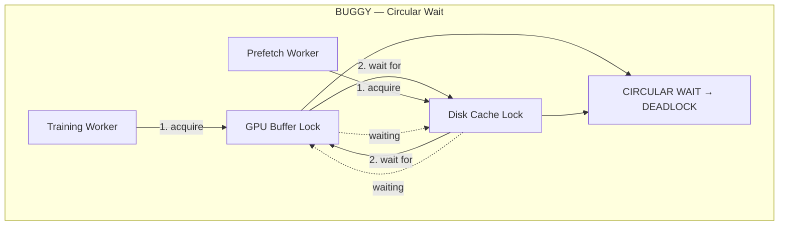

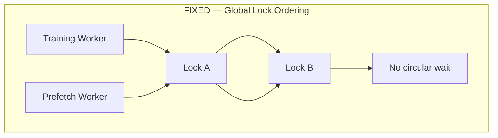

### Thread Contention
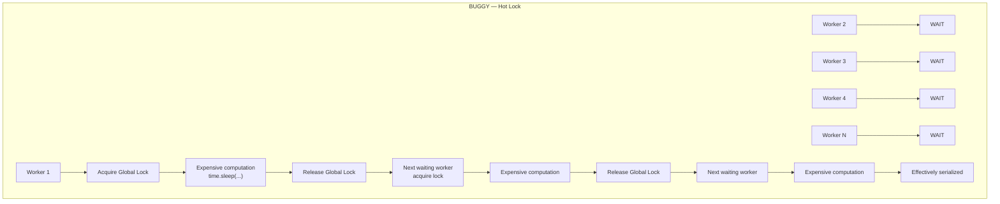

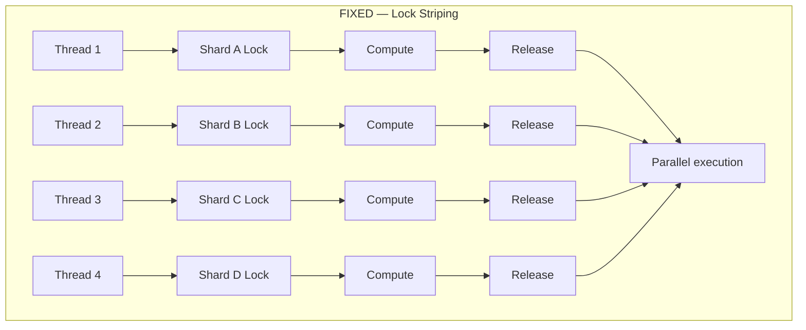

### I/O Contention
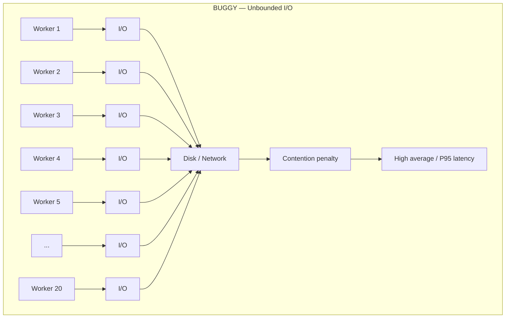

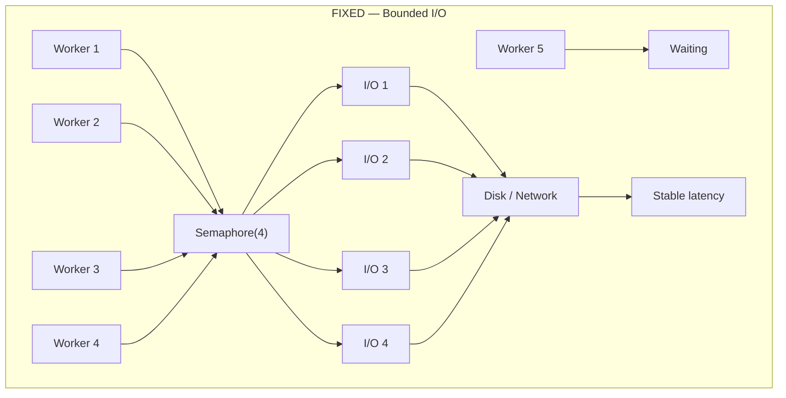

### CPU Contention

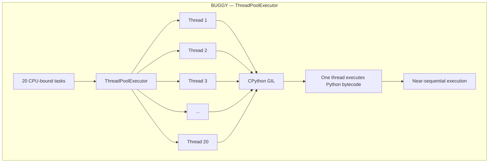

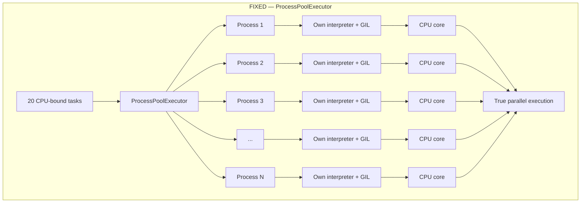
